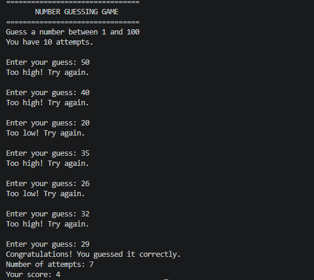

# DecodeLabs Java Project 1 — Number Guessing Game

## Student Details

**Student:** Purva Kurle  
**Project:** Project 1 — Number Guessing Game  
**Language:** Java

## Objective

The objective of this project is to create a simple Number Guessing Game in Java where the user has to guess a randomly generated number between 1 and 100.

## Features

- Generates a random number between 1 and 100.
- Allows the user a maximum of 10 attempts.
- Gives hints such as "Too high" or "Too low".
- Displays the number of attempts taken.
- Provides a score based on the number of attempts.
- Displays the correct number if the user cannot guess it.

## Concepts Used

- Java
- Random class
- Scanner class
- Loops
- Conditional statements
- Variables
- User input

## Scoring System

The score is calculated based on the number of attempts used.

**Score = Maximum Attempts - Attempts Used + 1**

## How to Run

### Step 1: Compile the program

```bash
javac NumberGame.java
```

### Step 2: Run the program

```bash
java NumberGame
```

## Sample Output

The program asks the user to enter a number between 1 and 100.

```text
================================
       NUMBER GUESSING GAME
================================
Guess a number between 1 and 100
You have 10 attempts.

Enter your guess: 50
Too high! Try again.

Enter your guess: 40
Too high! Try again.

Enter your guess: 20
Too low! Try again.

Enter your guess: 35
Too high! Try again.

Enter your guess: 26
Too low! Try again.

Enter your guess: 32
Too high! Try again.

Enter your guess: 29
Congratulations! You guessed it correctly.
Number of attempts: 7
Your score: 4
```

## Output Screenshot


## Project Structure

```text
Task-1-Purva-kurle
├── NumberGame.java
├── README.md
└── output.png
```

## Conclusion

This project helped me understand the basic concepts of Java such as random number generation, user input, loops, conditional statements and simple scoring logic.
